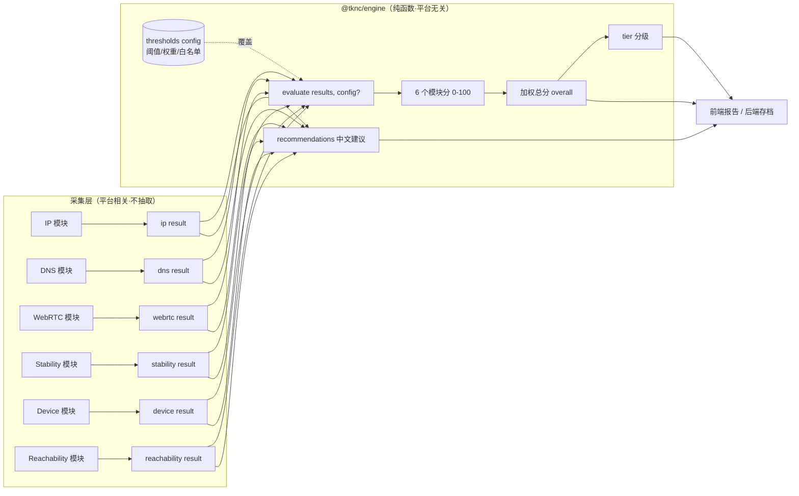

# 小白兔TKNC 判断逻辑文档

> 面向没读过前端代码的后端工程师（TJ-Social）。读完这份，你能独立接入判断引擎、看懂每个分数怎么来的、知道哪些阈值还是拍脑袋的。

## 0. 一句话哲学

TikTok 靠"信号不一致"识别可疑环境（机房 IP、时区和 IP 国家对不上、WebRTC 泄漏真实 IP……）。
我们把 **TikTok 会查的信号自己先查一遍，用规则打分**，在用户发布前告诉他环境干不干净。

判断分三类：

| 类别 | 问的问题 | 涉及模块 |
|---|---|---|
| ① 身份类 | 这个 IP 干不干净？ | IP |
| ② 一致性类 | 各种信号互相对得上吗？ | DNS(时区)、WebRTC、Device |
| ③ 质量类 | 这条线路稳不稳、快不快？ | Stability、Reachability |

---

## 1. 数据流

探测采集层（**留在前端**，不在引擎里）负责跑 6 个模块拿到 result 对象；
判断引擎（**本次抽出的 `@tknc/engine`**）是纯函数，只吃 result、吐分数和建议。



**模块间依赖**（采集层顺序，引擎不关心）：IP 先跑，DNS / WebRTC / Device 都依赖 IP 拿到的 `country` / `ip` 做交叉校验；Stability 最慢（30s）并行跑。

**引擎入口**：`evaluate(results, { config })` → `{ scores, overall, tier, recommendations, topIssues, configVersion }`。

---

## 2. 逐模块判断规则

> 每个阈值都标了 **`【经验值·待校准】`**——当前没有用真实发布数据验证过，改它就是改 `config`（见 `packages/tknc-engine/src/thresholds.js` 和 `docs/CALIBRATION.md`）。

### 模块 1 · IP 身份（权重 25，最重的一类之一）

**查什么信号**：公网出口 IP 的国家、ASN/机构名、是否机房、是否代理、第三方风险分。

**怎么判定**（从 100 分往下扣）：

| 条件 | 扣分 | config 字段 | 为什么 |
|---|---|---|---|
| 机房/IDC IP（`isHosting=true` 或 org/asn 命中 IDC 正则） | **-40** | `ip.hostingPenalty` | 机房 IP 是 TikTok 最敏感的信号，几乎等于"非真人环境"。扣最重。【经验值·待校准】 |
| 被标记为代理（`isProxy`） | -20 | `ip.proxyPenalty` | 第三方风险库判定为代理，养号难度上升。【经验值·待校准】 |
| 风险分 ≥ 75 | -30 | `ip.riskHighAt` / `riskHighPenalty` | 高风险分档。【经验值·待校准】 |
| 风险分 ≥ 25（且 <75） | -15 | `ip.riskMidAt` / `riskMidPenalty` | 中风险分档。【经验值·待校准】 |
| 国家不在白名单 | -10 | `ip.nonWhitelistCountryPenalty` | 非 TikTok 友好地区。【经验值·待校准】 |

**IDC 正则表**（`ip.idcAsnPatterns`）：匹配 org 或 asn 名称，命中即视为机房。当前 21 条：`amazon/aws/google/azure/ovh/digitalocean/linode/akamai/vultr/hetzner/m247/choopa/leaseweb/aliyun/tencent/huawei/oracle/server/hosting/idc/\bcdn\b`。**【经验值·待校准】**——`server`/`hosting` 这种宽词容易误伤合法住宅 ISP，是校准重点。

**国家白名单**（`ip.friendlyCountries`）：32 国（US/JP/KR/GB/… 详见 config）。**【经验值·待校准】**——凭直觉列的，可能过宽或过窄。

**克制处理**：`riskScore` 为 `null`（未知）时**不扣**风险分——不确定就不下结论。模块 `ok:false` → 直接 0 分。

---

### 模块 2 · DNS（降级版，权重 15）

**查什么信号**：（本工具没有自建权威 DNS 服务器，是降级版）
1. Google / Cloudflare 两家 DoH 是否可达；
2. 对**非 CDN 基准域**（`example.com`，IANA 稳定 A 记录）两家 DoH 解析是否一致；
3. 浏览器时区 vs IP 国家是否匹配。

> 为什么不比 `www.tiktok.com` 的解析？因为 CDN 域名**故意**按解析地返回不同节点，比了必然"不一致"，是噪声。只比非 CDN 基准域才是真信号。

**怎么判定**（基础分 70，上限 90）：

| 条件 | 加/扣分 | config 字段 | 为什么 |
|---|---|---|---|
| 两家 DoH 都可达 | +10 | `dns.bothDohBonus` | 网络对 DNS 无过滤，健康。【经验值·待校准】 |
| 仅一家可达 | -10 | `dns.oneDohUnreachablePenalty` | 疑似有过滤策略。【经验值·待校准】 |
| 两家都不可达 | -30 | `dns.noDohPenalty` | 严格 DNS 过滤，TikTok 几乎不可用。【经验值·待校准】 |
| 基准域双源解析不一致 | -30 | `dns.baselineInconsistentPenalty` | **DNS 劫持强信号**。【经验值·待校准】 |
| 时区匹配 IP 国家 | +20 | `dns.tzMatchBonus` | 一致性好。【经验值·待校准】 |
| 时区不匹配 IP 国家 | -30 | `dns.tzMismatchPenalty` | 代理痕迹强信号。【经验值·待校准】 |

**基础分 70 / 上限 90**（`dns.base` / `dns.cap`）：**诚实披露**——因为是降级版，就算全绿也不给满分，避免让用户以为 DNS 完全没问题。**【经验值·待校准】**

**克制处理**：`baselineConsistent === null`（两家没都回数据，样本不足）→ **不扣分**；`tzCountryMatch === null`（IP 国家未知或时区区域不认识）→ 不加不扣。

---

### 模块 3 · WebRTC / IPv6 泄漏（权重 15）

**查什么信号**：用 STUN 收集 ICE 候选，看 WebRTC 探到的公网 IP 是否和代理 IP 一致；有没有 IPv6 直连；有没有暴露真实内网 IP。

**怎么判定**（从 100 扣）：

| 条件 | 扣分 | config 字段 | 为什么 |
|---|---|---|---|
| WebRTC 泄漏真实 IP（srflx IP ≠ 代理 IP） | **-50** | `webrtc.leakPenalty` | TikTok 可绕过代理拿真实 IP，致命。【经验值·待校准】 |
| IPv6 直连（`hasIpv6Leak`） | -30 | `webrtc.ipv6LeakPenalty` | IPv6 未走代理。【经验值·待校准】 |
| 暴露真实内网 IP | -10 | `webrtc.localIpPenalty` | 浏览器隐私设置宽松。【经验值·待校准】 |

**克制处理（重要）**：IP 模块失败时 `referenced=false`，此时**没有对比基准，绝不判"泄漏"**，并把分数**封顶到 60**（`webrtc.unreferencedCap`）以示结果不完整——宁可说"没测出来"也不冤枉用户。

---

### 模块 4 · 网络稳定性（权重 25，最重的一类之一）

**查什么信号**：30 秒持续采样 TikTok 5 个域名，聚合出平均延迟(TTFB)、抖动(stddev)、丢包率、TLS 握手时间。

**怎么判定**：每个维度用**线性打分** `linearScore(value, low, high)`——`value≤low` 得 100，`≥high` 得 0，中间线性；最后对**可测维度**取平均（null 维度剔除，不参与）。

| 维度 | low（满分线） | high（0 分线） | config 字段 | 单位 |
|---|---|---|---|---|
| 延迟 latency | 150 | 800 | `stability.latency` | ms |
| 抖动 jitter | 30 | 200 | `stability.jitter` | ms |
| TLS 握手 | 200 | 1000 | `stability.tls` | ms |
| 丢包 loss | 0 | 20 | `stability.loss` | % |

**这四组区间是最该被真实数据校准的**——现在纯拍脑袋。**【经验值·待校准】**

**粗测模式扣分**：浏览器（Safari/Firefox）对跨域 opaque 响应不给完整时序时，用 `duration` 兜底，`coarse=true` → 额外 -5（`stability.coarsePenalty`）。**【经验值·待校准】**

**克制处理**：某维度 `null`（未测量）→ 从平均里**剔除**，不当 0 也不当满分；所有维度都不可测 → 0 分。`0` 和 `null` 严格区分——0 是真慢，null 是没测到。

---

### 模块 5 · 设备一致性（权重 10）

**查什么信号**：系统时区、语言、UA、屏幕尺寸，与 IP 国家交叉校验。

**怎么判定**（从 100 扣）：

| 条件 | 扣分 | config 字段 | 为什么 |
|---|---|---|---|
| 时区与 IP 国家冲突 | -30 | `device.tzMismatchPenalty` | 强代理痕迹。【经验值·待校准】 |
| 语言与 IP 国家不符 | -20 | `device.langMismatchPenalty` | 次强信号。【经验值·待校准】 |
| UA 与屏幕尺寸不符 | -10 | `device.uaScreenMismatchPenalty` | 指纹修改/模拟器痕迹。【经验值·待校准】 |

**克制处理**：IP 国家未知（`ipCountry` 空）时无法做最重要的两个交叉校验 → 封顶 60（`device.noIpCap`）。各 match 字段为 `null`（映射表不认识该时区/语言）→ 不扣。

---

### 模块 6 · TikTok 可达性（权重 10）

**查什么信号**：主站 / API / CDN 三个探针，各最多重试 3 次。

**怎么判定**：

- 三个探针**全失败**（`successes===0`）→ 0 分；
- 否则 `100 - 25 × 总重试次数`（`reachability.retryPenaltyPer`），clamp 到 0。**【经验值·待校准】**

**为什么**：重试次数反映线路稳定性；偶发失败意味着上传/直播会掉。

---

## 3. 加权总分与 tier 分级

**总分**：`overall = Σ(模块分 × 权重) / Σ权重`。

| 模块 | 权重 | config 字段 |
|---|---|---|
| IP | 25 | `weights.ip` |
| Stability | 25 | `weights.stability` |
| DNS | 15 | `weights.dns` |
| WebRTC | 15 | `weights.webrtc` |
| Device | 10 | `weights.device` |
| Reachability | 10 | `weights.reachability` |

权重和为 100。**IP + Stability 占一半**——身份和线路质量是命门。**【经验值·待校准】**：这套权重是直觉分配，校准的核心目标之一就是用真实"0播放/限流"数据反推真实权重。

**tier 分级**（`config.tiers`）：

| tier | 分数区间 | config 字段 |
|---|---|---|
| excellent | ≥ 90 | `tiers.excellentAt` |
| good | 70–89 | `tiers.goodAt` |
| warning | 50–69 | `tiers.warningAt` |
| danger | < 50 | （兜底） |

**【经验值·待校准】**：90/70/50 三条线也没被验证过。

---

## 4. 后端接入速查

```js
import { evaluate } from '@tknc/engine';

// results = 前端/采集端传来的 6 个模块 result 对象（结构见上文各模块）
const report = evaluate(results);
// → { scores:{ip,dns,webrtc,stability,device,reachability,overall}, overall, tier, recommendations, topIssues, configVersion }

// 校准后想用新阈值：
import calibrated from './config/thresholds-v1.json' assert { type: 'json' };
const report2 = evaluate(results, { config: calibrated });
```

- 引擎是纯函数，**同样输入永远同样输出**，可直接写回归测试。
- 每次评分建议把 `report.configVersion` 一起落库，方便日后"这个分是用哪版阈值算的"。
- 前端迁移说明见 `packages/tknc-engine/MIGRATION.md`。

---

## 5. 阈值一览（全部待校准）

所有数字集中在 `packages/tknc-engine/src/thresholds.js` 的 `DEFAULT_CONFIG`。校准 = 生成一份覆盖 config。清单：

- 权重 ×6
- IP：扣分 ×4、风险分档 ×2、白名单 32 国、IDC 正则 21 条
- DNS：base/cap + 加扣分 ×6
- WebRTC：扣分 ×3 + 封顶
- Stability：4 维度 ×(low,high) + 粗测扣分 + 文案阈值 ×4
- Device：扣分 ×3 + 封顶
- Reachability：每重试扣分
- tier 边界 ×3

**一个都没被真实数据验证过。** 怎么验，见 `CALIBRATION.md`。
